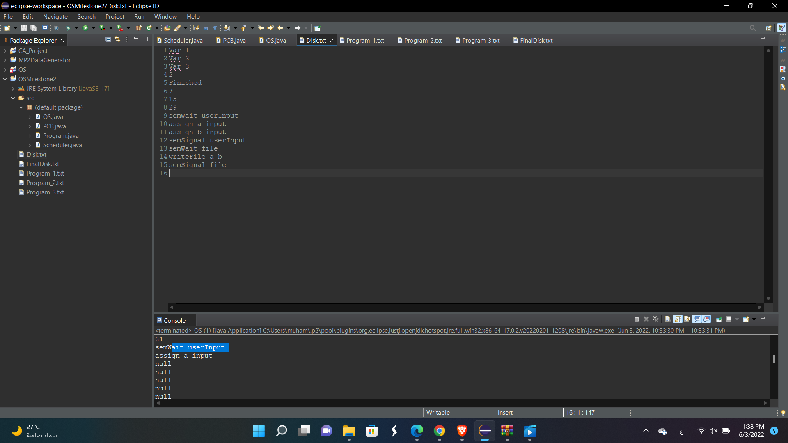

# 🧠 OS Scheduler Simulation (Java)

This project is a **Java-based simulation of an Operating System scheduler**, developed as part of an academic milestone.

It demonstrates how an OS handles:

* Process scheduling
* Process Control Blocks (PCB)
* Program execution
* Disk interaction using file-based simulation

---

## 🚀 Features

* Simulates multiple programs running as processes
* Implements a scheduling algorithm (e.g., Round Robin)
* Uses text files to represent memory/disk
* Tracks process states and execution flow

---

## 📁 Project Structure

```
OS-Scheduler/
│
├── src/
│   ├── OS.java              # Main entry point
│   ├── Scheduler.java      # Scheduling logic
│   ├── PCB.java            # Process Control Block
│   └── Program.java        # Program representation
│
├── Program_1.txt           # Input program 1
├── Program_2.txt           # Input program 2
├── Program_3.txt           # Input program 3
├── Disk.txt                # Initial disk state
├── Final output in the disk.png  # Output result
```

---

## ▶️ How to Run

1. Open the project in IntelliJ IDEA or Eclipse
2. Make sure `src/` is marked as **Sources Root**
3. Run:

   ```
   OS.java
   ```
4. Check console output and updated disk file

---

## 🖥️ Run With UI (Swing)

You can run the simulator from a simple desktop UI:

1. Open the project in IntelliJ IDEA or Eclipse
2. Run:

   ```
   SchedulerUI.java
   ```

Or from the terminal (project root):

```
javac src/*.java
java -cp src SchedulerUI
```

In the UI, choose `Mode`:

- `Legacy`: runs the original implementation and shows `Memory` + `FinalDisk`
- `Realistic`: runs a more OS-like simulation with proper blocking/unblocking on `semWait/semSignal` and executes instructions like `assign`, `print`, `readFile`, `writeFile`

### How the UI Works

- `Programs` table: set each program file path and arrival time.
- `Quantum`: number of instruction slots per CPU turn (Round Robin).
- `Console` tab: full trace of what happened (arrivals, running, blocking, outputs).
- `Memory` / `FinalDisk` tabs (Legacy mode only): snapshots taken from the legacy scheduler implementation.
- `Summary` tab (Realistic mode): per-process timing metrics (start/finish/turnaround/response) + final variables.
- `Input` tab (Realistic mode): when a process executes `assign X input`, the simulation pauses and waits until you submit a value.
- `Timeline` tab (Realistic mode): structured events + a simple Gantt view; export via `File → Export Trace (CSV)`.

## ▶️ Run Realistic Mode (CLI)

```
javac src/*.java
java -cp src RealisticOS
```

### How Realistic Mode Works (High Level)

- **Scheduling**: Round Robin using the chosen quantum.
- **Mutexes/Semaphores**: `semWait <name>` acquires a mutex or blocks; `semSignal <name>` releases or transfers ownership to the next blocked process.
- **States**: `NEW → READY → RUNNING → (BLOCKED) → READY → FINISHED`.
- **Time model**: time increases by 1 per instruction slot.

## 📚 Full Documentation

- `docs/HOW_IT_WORKS.md`

---

## 🖼️ Final Output

Below is the final state of the disk after execution:



---

## 🛠️ Technologies Used

* Java
* File I/O
* Basic OS Scheduling Concepts

---

## 📌 Notes

* Ensure all `.txt` files are in the root directory
* The working directory must be set correctly in your IDE

---

## 👨‍💻 Author

Muhammad Magdy
